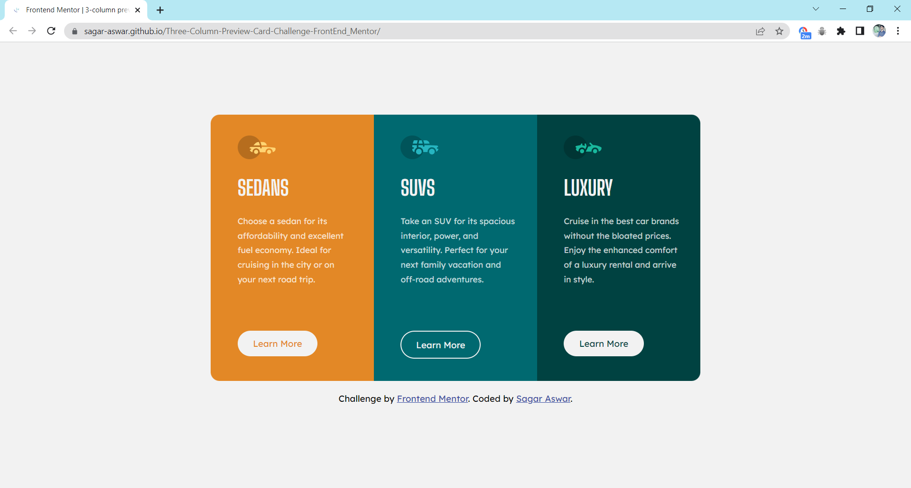

# Frontend Mentor - 3-column preview card component solution

This is a solution to the [3-column preview card component challenge on Frontend Mentor](https://www.frontendmentor.io/challenges/3column-preview-card-component-pH92eAR2-). Frontend Mentor challenges help you improve your coding skills by building realistic projects. 
### Screenshot

### Links

- Live Site URL: [Click Here](https://sagar-aswar.github.io/Three-Column-Preview-Card-Challenge-FrontEnd_Mentor/)

### Built with

- Semantic HTML5 markup
- CSS custom properties
- CSS Flexbox
- Mobile-first workflow

## Author

- Website - [Sagar Aswar](https://github.com/sagar-aswar)
- Frontend Mentor - [@sagar-aswar](https://www.frontendmentor.io/profile/sagar-aswar)
- Twitter - [@theSagarAswar](https://www.twitter.com/theSagarAswar)